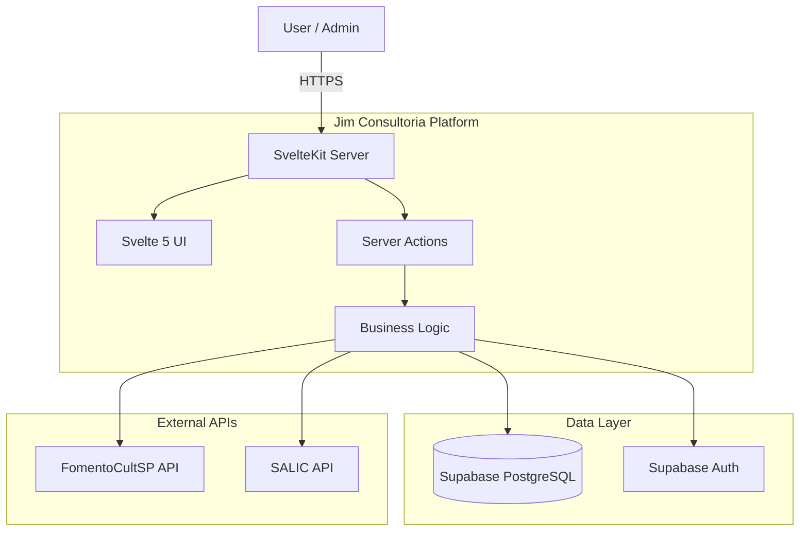
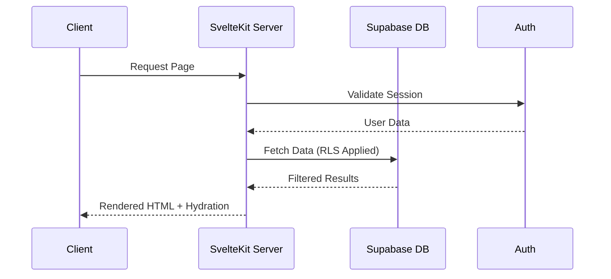

<h1 align="center">
  <br>
  
  <br>
  Jim Consultoria - Cultural Grants CRM Platform
  <br>
</h1>

<p align="center">
  <strong>A modern consultancy platform for managing Brazilian cultural incentive programs, tracking leads, and evaluating grant eligibility.</strong>
</p>

<p align="center">
  <a href="./README.pt-BR.md">Portugues</a>
</p>

<p align="center">
  
  
  
  
  
  
</p>

<br>

<p align="center">
  <a href="#sparkles-features">Features</a>&nbsp;&nbsp;&nbsp;|&nbsp;&nbsp;&nbsp;
  <a href="#art-architecture">Architecture</a>&nbsp;&nbsp;&nbsp;|&nbsp;&nbsp;&nbsp;
  <a href="#computer-technologies">Technologies</a>&nbsp;&nbsp;&nbsp;|&nbsp;&nbsp;&nbsp;
  <a href="#package-installation">Installation</a>&nbsp;&nbsp;&nbsp;|&nbsp;&nbsp;&nbsp;
  <a href="#rocket-usage">Usage</a>&nbsp;&nbsp;&nbsp;|&nbsp;&nbsp;&nbsp;
  <a href="#memo-license">License</a>
</p>

<br>

## :sparkles: Features

### Lead Management (CRM)

- **Pipeline Visualization** - Kanban-style board to track leads through stages
- **Lead Scoring** - Automatic eligibility scoring algorithm for grant programs
- **Contact Management** - Store organization info, cultural areas, and grant interests
- **Activity Tracking** - Log notes, calls, emails, and status changes

### Grant Programs Support

- **ProAC ICMS** - Sao Paulo state tax incentive program
- **Lei Rouanet** - Federal cultural incentive law
- **PNAB** - Politica Nacional Aldir Blanc (national cultural policy)
- **Government API Integration** - Real-time data from FomentoCultSP and SALIC APIs

### Task & Activity Management

- **Task Assignment** - Link tasks to leads and grants with priority levels
- **Activity Log** - Complete audit trail of all interactions
- **Deadline Tracking** - Never miss important grant submission dates

### Security & Performance

- **Row Level Security** - PostgreSQL RLS policies for data isolation
- **Server-Side Rendering** - Fast initial loads with SvelteKit SSR
- **Real-time Updates** - Powered by Supabase subscriptions

<br>

## :art: Architecture

### System Overview



### Data Flow



<br>

## :computer: Technologies

### Core Framework

- **[SvelteKit](https://kit.svelte.dev/)** 2.x - Full-stack web framework
- **[Svelte](https://svelte.dev/)** 5 - Reactive UI with Runes (`$state`, `$derived`, `$effect`)
- **[TypeScript](https://www.typescriptlang.org/)** 5.x - Type-safe development

### Backend & Database

- **[Supabase](https://supabase.com/)** - PostgreSQL database with RLS
- **[Supabase Auth](https://supabase.com/auth)** - Authentication & authorization
- **[Zod](https://zod.dev/)** v4 - Schema validation
- **[Superforms](https://superforms.rocks/)** - Form handling for SvelteKit

### Frontend & Design

- **[Tailwind CSS](https://tailwindcss.com/)** 4.0 - Utility-first styling
- **[svelte-dnd-action](https://github.com/isaacHagworthy/svelte-dnd-action)** - Drag and drop for Kanban

### Quality & Tools

- **[Biome](https://biomejs.dev/)** - Fast linting and formatting
- **[pnpm](https://pnpm.io/)** - Efficient package manager

<br>

## :package: Installation

### Prerequisites

- **[Node.js](https://nodejs.org/)** 20+
- **[pnpm](https://pnpm.io/)** 8+
- **[Supabase Account](https://supabase.com/)** (free tier works)

### Quick Start

1. **Clone the repository**

```bash
git clone https://github.com/gabrielmaialva33/jim-consultoria.git
cd jim-consultoria
```

2. **Install dependencies**

```bash
pnpm install
```

3. **Configure environment**

```bash
cp .env.example .env
```

Fill in your Supabase credentials:
```env
PUBLIC_SUPABASE_URL=your-project-url
PUBLIC_SUPABASE_ANON_KEY=your-anon-key
```

4. **Run database migrations**

```bash
# Using Supabase CLI
supabase db push
```

5. **Start the development server**

```bash
pnpm dev
```

6. **Open in browser**

Navigate to [http://localhost:5173](http://localhost:5173)

<br>

## :rocket: Usage

### Lead Management

1. Navigate to **Admin > Leads** in the dashboard
2. Click **New Lead** to add a contact
3. Fill in organization details, cultural areas, and grant interests
4. The system automatically calculates eligibility score
5. Drag leads across pipeline stages on the Kanban board

### Grants Exploration

1. Go to **Grants** page to explore approved projects
2. Filter by program: ProAC ICMS, ProAC Editais, PNAB
3. Search by project name or proponent
4. View project details and funding information

### Task Management

1. Create tasks linked to specific leads
2. Set priority levels and due dates
3. Track progress and mark as complete

<br>

## :hammer_and_wrench: Commands

```bash
pnpm dev          # Start development server
pnpm build        # Production build
pnpm preview      # Preview production build
pnpm check        # TypeScript type checking
pnpm lint         # Check with Biome
pnpm lint:fix     # Auto-fix lint issues
```

<br>

## :memo: License

This project is under the **MIT** license. See [LICENSE](./LICENSE) for details.

<br>

## :handshake: Contributing

Contributions are welcome! Please feel free to submit a Pull Request.

1. Fork the project
2. Create your feature branch (`git checkout -b feature/AmazingFeature`)
3. Commit your changes (`git commit -m 'Add amazing feature'`)
4. Push to the branch (`git push origin feature/AmazingFeature`)
5. Open a Pull Request

<br>

## :busts_in_silhouette: Author

<p align="center">
  
</p>

<p align="center">
  Made with :heart: by <strong>Maia</strong>
</p>

<p align="center">
  <a href="mailto:gabrielmaialva33@gmail.com">gabrielmaialva33@gmail.com</a>
  &nbsp;|&nbsp;
  <a href="https://github.com/gabrielmaialva33">@gabrielmaialva33</a>
</p>

<br>

<p align="center">
  
</p>

<p align="center">
  <strong>Jim Consultoria - Empowering Cultural Projects in Brazil</strong>
</p>

<p align="center">
  &copy; 2017-present <a href="https://github.com/gabrielmaialva33/" target="_blank">Maia</a>
</p>
