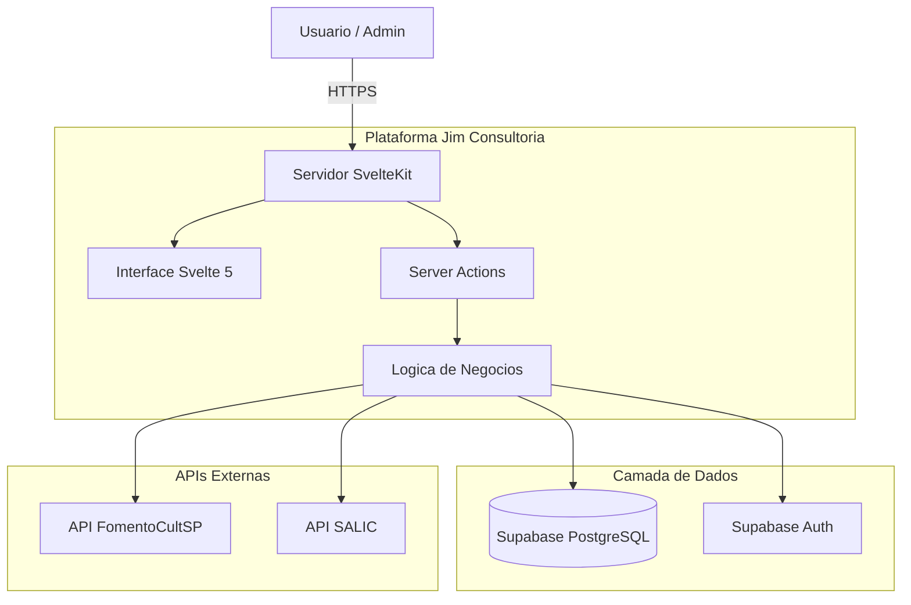
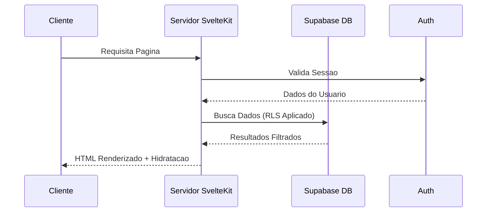

<h1 align="center">
  <br>
  
  <br>
  Jim Consultoria - Plataforma CRM para Editais Culturais
  <br>
</h1>

<p align="center">
  <strong>Uma plataforma moderna de consultoria para gerenciar programas de incentivo cultural brasileiros, rastrear leads e avaliar elegibilidade para editais.</strong>
</p>

<p align="center">
  <a href="./README.md">English</a>
</p>

<p align="center">
  
  
  
  
  
  
</p>

<br>

<p align="center">
  <a href="#sparkles-funcionalidades">Funcionalidades</a>&nbsp;&nbsp;&nbsp;|&nbsp;&nbsp;&nbsp;
  <a href="#art-arquitetura">Arquitetura</a>&nbsp;&nbsp;&nbsp;|&nbsp;&nbsp;&nbsp;
  <a href="#computer-tecnologias">Tecnologias</a>&nbsp;&nbsp;&nbsp;|&nbsp;&nbsp;&nbsp;
  <a href="#package-instalacao">Instalacao</a>&nbsp;&nbsp;&nbsp;|&nbsp;&nbsp;&nbsp;
  <a href="#rocket-uso">Uso</a>&nbsp;&nbsp;&nbsp;|&nbsp;&nbsp;&nbsp;
  <a href="#memo-licenca">Licenca</a>
</p>

<br>

## :sparkles: Funcionalidades

### Gestao de Leads (CRM)

- **Visualizacao em Pipeline** - Quadro Kanban para acompanhar leads por etapas
- **Pontuacao de Leads** - Algoritmo automatico de elegibilidade para programas de fomento
- **Gestao de Contatos** - Armazene informacoes da organizacao, areas culturais e interesses em editais
- **Registro de Atividades** - Registre notas, ligacoes, e-mails e mudancas de status

### Suporte a Programas de Fomento

- **ProAC ICMS** - Programa de incentivo fiscal do estado de Sao Paulo
- **Lei Rouanet** - Lei federal de incentivo a cultura
- **PNAB** - Politica Nacional Aldir Blanc
- **Integracao com APIs Governamentais** - Dados em tempo real do FomentoCultSP e SALIC

### Gestao de Tarefas e Atividades

- **Atribuicao de Tarefas** - Vincule tarefas a leads e editais com niveis de prioridade
- **Historico de Atividades** - Trilha de auditoria completa de todas as interacoes
- **Acompanhamento de Prazos** - Nunca perca datas importantes de submissao

### Seguranca e Performance

- **Row Level Security** - Politicas RLS do PostgreSQL para isolamento de dados
- **Server-Side Rendering** - Carregamentos rapidos com SSR do SvelteKit
- **Atualizacoes em Tempo Real** - Alimentado por subscriptions do Supabase

<br>

## :art: Arquitetura

### Visao Geral do Sistema



### Fluxo de Dados



<br>

## :computer: Tecnologias

### Framework Principal

- **[SvelteKit](https://kit.svelte.dev/)** 2.x - Framework web full-stack
- **[Svelte](https://svelte.dev/)** 5 - UI reativa com Runes (`$state`, `$derived`, `$effect`)
- **[TypeScript](https://www.typescriptlang.org/)** 5.x - Desenvolvimento com tipagem segura

### Backend e Banco de Dados

- **[Supabase](https://supabase.com/)** - Banco PostgreSQL com RLS
- **[Supabase Auth](https://supabase.com/auth)** - Autenticacao e autorizacao
- **[Zod](https://zod.dev/)** v4 - Validacao de schemas
- **[Superforms](https://superforms.rocks/)** - Manipulacao de formularios para SvelteKit

### Frontend e Design

- **[Tailwind CSS](https://tailwindcss.com/)** 4.0 - Estilizacao utility-first
- **[svelte-dnd-action](https://github.com/isaacHagworthy/svelte-dnd-action)** - Drag and drop para Kanban

### Qualidade e Ferramentas

- **[Biome](https://biomejs.dev/)** - Linting e formatacao rapidos
- **[pnpm](https://pnpm.io/)** - Gerenciador de pacotes eficiente

<br>

## :package: Instalacao

### Pre-requisitos

- **[Node.js](https://nodejs.org/)** 20+
- **[pnpm](https://pnpm.io/)** 8+
- **[Conta Supabase](https://supabase.com/)** (plano gratuito funciona)

### Inicio Rapido

1. **Clone o repositorio**

```bash
git clone https://github.com/gabrielmaialva33/jim-consultoria.git
cd jim-consultoria
```

2. **Instale as dependencias**

```bash
pnpm install
```

3. **Configure o ambiente**

```bash
cp .env.example .env
```

Preencha suas credenciais do Supabase:
```env
PUBLIC_SUPABASE_URL=url-do-seu-projeto
PUBLIC_SUPABASE_ANON_KEY=sua-anon-key
```

4. **Execute as migrations do banco**

```bash
# Usando Supabase CLI
supabase db push
```

5. **Inicie o servidor de desenvolvimento**

```bash
pnpm dev
```

6. **Abra no navegador**

Acesse [http://localhost:5173](http://localhost:5173)

<br>

## :rocket: Uso

### Gestao de Leads

1. Navegue ate **Admin > Leads** no painel
2. Clique em **Novo Lead** para adicionar um contato
3. Preencha os dados da organizacao, areas culturais e interesses em editais
4. O sistema calcula automaticamente a pontuacao de elegibilidade
5. Arraste leads entre as etapas do pipeline no quadro Kanban

### Exploracao de Editais

1. Acesse a pagina **Editais** para explorar projetos aprovados
2. Filtre por programa: ProAC ICMS, ProAC Editais, PNAB
3. Pesquise por nome do projeto ou proponente
4. Visualize detalhes do projeto e informacoes de financiamento

### Gestao de Tarefas

1. Crie tarefas vinculadas a leads especificos
2. Defina niveis de prioridade e datas de vencimento
3. Acompanhe o progresso e marque como concluido

<br>

## :hammer_and_wrench: Comandos

```bash
pnpm dev          # Inicia servidor de desenvolvimento
pnpm build        # Build de producao
pnpm preview      # Preview do build de producao
pnpm check        # Verificacao de tipos TypeScript
pnpm lint         # Verifica com Biome
pnpm lint:fix     # Corrige problemas de lint automaticamente
```

<br>

## :memo: Licenca

Este projeto esta sob a licenca **MIT**. Veja [LICENSE](./LICENSE) para detalhes.

<br>

## :handshake: Contribuindo

Contribuicoes sao bem-vindas! Sinta-se a vontade para enviar um Pull Request.

1. Faca um fork do projeto
2. Crie sua branch de feature (`git checkout -b feature/RecursoIncrivel`)
3. Commit suas alteracoes (`git commit -m 'Adiciona recurso incrivel'`)
4. Push para a branch (`git push origin feature/RecursoIncrivel`)
5. Abra um Pull Request

<br>

## :busts_in_silhouette: Autor

<p align="center">
  
</p>

<p align="center">
  Feito com :heart: por <strong>Maia</strong>
</p>

<p align="center">
  <a href="mailto:gabrielmaialva33@gmail.com">gabrielmaialva33@gmail.com</a>
  &nbsp;|&nbsp;
  <a href="https://github.com/gabrielmaialva33">@gabrielmaialva33</a>
</p>

<br>

<p align="center">
  
</p>

<p align="center">
  <strong>Jim Consultoria - Fortalecendo Projetos Culturais no Brasil</strong>
</p>

<p align="center">
  &copy; 2017-presente <a href="https://github.com/gabrielmaialva33/" target="_blank">Maia</a>
</p>
